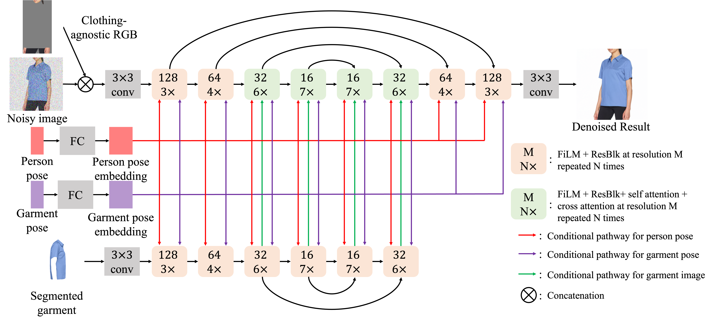

# TryOnDiffusion: A Tale of Two UNets



## Introduction
This is an unofficial implementation of the ["TryOnDiffusion: A Tale of Two UNets" paper](https://arxiv.org/abs/2306.08276).

In this repository you can find:
1. Code implementation of the two novel "Parallel UNet" architectures described in the paper.
    * The base 128x128 UNet
    * The super-resolution 256x256 UNet
2. Imagen-inspired class which implements cascading between a sequence of Parallel UNets
3. Imagen  trainer class which manages training of multiple UNets
4. Example test scripts which demonstrate how to instantiate and work with the UNets, Imagen and Trainer classes.

In this repository you WON'T find:
1. Data-related code to create model inputs (e.g. clothing-agnostic image)
    * Data preparation has many degrees of freedom such as choice of human parser, pose keypoints model and format, etc. We felt it would be better to keep the architecture and training logic independent.

You are welcome to join our Fashion E-Commerce community <a href="https://discord.gg/qfZ9G76Btp"></a> and share your thoughts with us regarding this project in the dedicated # :dress: | virtual-try-on channel

## Special Thanks
* [Phil Wang](https://github.com/lucidrains) - For his open-source implementation of [Imagen](https://github.com/lucidrains/imagen-pytorch/tree/main), which served as the core codebase for this repository.
* [Katherine Crowson](https://github.com/crowsonkb) - Some of the "secret sauce" needed to make this repository work, such as Adaptive Group Norm (AdaGN) was adapted from [k-diffusion](https://github.com/crowsonkb/k-diffusion)

## Usage
To get a better sense of how to use this repository, please look at the example scripts available in `./examples`

### Instantiating the UNets
```python
from tryondiffusion import BaseParallelUnet

unet = BaseParallelUnet()

noisy_images = torch.randn(1, 3, 128, 128)
ca_images = torch.randn(1, 3, 128, 128)
garment_images = torch.randn(1, 3, 128, 128)
person_poses = torch.randn(1, 18, 2)
garment_poses = torch.randn(1, 18, 2)
time = torch.randn(1,)
ca_noise_times = torch.randn(1,)
garment_noise_times = torch.randn(1,)

output = unet(
    noisy_images=noisy_images,
    time=time,
    lowres_cond_img=lowres_cond_images,
    lowres_noise_times=lowres_noise_times,
    ca_images=ca_images,
    ca_noise_times=ca_noise_times,
    garment_images=garment_images,
    garment_noise_times=garment_noise_times,
    person_poses=person_poses,
    garment_poses=garment_poses,
)
print(output.shape) # (1, 3, 128, 128)
```
For more control over the UNet structure, you can instantiate from the `tryondiffusion.ParallelUNet` class directly or edit the pre-defined templates.
```python
class BaseParallelUnet(ParallelUNet):
    def __init__(self, *args, **kwargs):
        default_kwargs = dict(
            image_size=(128, 128),
            dim=128,
            context_dim=512,
            time_cond_dim=512,
            pose_depth=2,
            feature_channels=(128, 256, 512, 1024),
            num_blocks=(3, 4, 6, 7),
            layer_attns=(False, False, True, True),
            layer_cross_attns=(False, False, True, True),
            attn_heads=(None, None, 4, 8),
            attn_dim_head=(None, None, 128, 64),
        )
        super().__init__(*args, **{**default_kwargs, **kwargs})
```

### UNets Cascading
Use the `tryondiffusion.TryOnImagen` class to manage multiple UNets for training and sampling

```python
from tryondiffusion import TryOnImagen, get_unet_by_name

unet1 = get_unet_by_name("base")
unet2 = get_unet_by_name("sr")

device = "cuda" if torch.cuda.is_available() else "cpu"

imagen = TryOnImagen(
    unets=(unet1, unet2),
    image_sizes=((128, 128), (256, 256)),
    timesteps=(256, 128),
)
imagen = imagen.to(device)
```
Perform a forward pass to get the loss
```python
person_images = person_images.to(device)
ca_images = ca_images.to(device)
garment_images = garment_images.to(device)
person_pose = person_pose.to(device)
garment_pose = garment_pose.to(device)

loss = imagen(
    person_images=person_images,
    ca_images=ca_images,
    garment_images=garment_images,
    person_poses=person_pose,
    garment_poses=garment_pose,
    unet_number=TRAIN_UNET_NUMBER,
)
loss.backward()
```
Call the `sample` method to generate images in a cascade
```python
images = imagen.sample(
    # notice we don't pass person_images
    ca_images=ca_images,
    garment_images=garment_images,
    person_poses=person_pose,
    garment_poses=garment_pose,
    batch_size=1,
    cond_scale=2.0,
    start_at_unet_number=1,
    return_all_unet_outputs=False,
    return_pil_images=True,
    use_tqdm=True,
    use_one_unet_in_gpu=True,
)
images[0].show()  # or images[0].save("output.png")
```
### Training
Use the `tryondiffusion.TryOnImagenTrainer` class to handle training multiple UNets and manage their states.

*This class is almost identical to the `ImagenTrainer` from the original [imagen-pytorch](https://github.com/lucidrains/imagen-pytorch/tree/main) repository, so you can also refer to it for more examples on how to use it.*

```python
from tryondiffusion import TryOnImagenTrainer

trainer = TryOnImagenTrainer(
    imagen=imagen,
    lr=1e-4,
    eps=1e-8,
    betas=(0.9, 0.99),
    max_grad_norm=1.0,
    checkpoint_every=5000,
    checkpoint_path="./checkpoints"
    # use the 'accelerate_` prefix to pass arguments to the underlying `accelerate.Accelerator`
    accelerate_cpu=True,
    accelerate_gradient_accumulation_steps=8,
    # see more options in the class definition
)

# see ./examples/test_tryon_imagen_trainer.py for an example dataset and dataloader
trainer.add_train_dataloader(train_dataloader)
trainer.add_valid_dataloader(validation_dataloader)

# training loop
for i in range(10):
    # choose which unet in the cascade you wish to train
    loss = trainer.train_step(unet_number=1)
    print(f"train loss: {loss}")

# validation
valid_loss = trainer.valid_step(unet_number=1)
print(f"valid loss: {valid_loss}")

# sampling with the trainer
validation_sample = next(trainer.valid_dl_iter)
_ = validation_sample.pop("person_images") # person_images are only for training
imagen_sample_kwargs = dict(
    **validation_sample,
    batch_size=BATCH_SIZE,
    cond_scale=2.0,
    start_at_unet_number=1,
    return_all_unet_outputs=True,
    return_pil_images=True,
    use_tqdm=True,
    use_one_unet_in_gpu=True,
)
images = trainer.sample(**imagen_sample_kwargs)
for unet_output in images:
    for image in unet_output:
        image.show()
```
## Results
Some context regarding our experiment, which doesn't follow the original paper exactly:
- The dataset for this experiment was composed of 2M training samples scraped from the web.
- Many fashion categories were allowed (tops, jackets, pants, dresses, etc.)
- All model poses were allowed (front, side, back, etc.) but not all pair combinations were allowed (e.g. frontal image could not be paired with a back image)
- The base UNet was trained for 250k steps with a batch size of 256
- The SR UNet was trained for 125k steps with a batch size of 256
 
### Base Parallel UNet (128x128)
Already at 250k steps (50% from the 500k prescribed by the paper) we can see some outstanding results on difficult background, fabrics and poses. Thus, we stopped at this stage to focus on the SR UNet.


### Base Parallel UNet → SR Parallel UNet Cascade (256x256)
At 125k steps, we can see that the SR UNet does a successful job at upscaling the base UNet output. It adds a lot of detail and even fixes mistakes in the input image. However, as is immediately apparent there is a persistent color tint which plagues the generation results.
This is a known issue which is well-documented in related literature for diffusion upscalers. Other researchers we know that have tried to implement this paper have also reported this phenomenon. 

## Future Steps
We have stopped pursuing this direction, as we currently have other ideas that we prefer to explore for virtual try-on (and our resources are limited). However, we still believe this implementation is mostly correct and might be improved by:
1. Changing the prediction objective of the SR UNet to `v` as suggested by [Progressive Distillation for Fast Sampling of Diffusion Models](https://arxiv.org/abs/2202.00512), and was reported to remedy the color shift issue in upscaling UNets for video. This is already implemented and can be tried by changing the prediction objective in the `TryOnImagen` class.
```python
imagen = TryOnImagen(...,
                    pred_objectives=("noise", "v"),
                    ...
                    )
```
2. Implement a shifted-cosine noise schedule for the SR UNet as suggested by [Simple diffusion: End-to-end diffusion for high resolution images](https://arxiv.org/abs/2301.11093), which should help the network focus on low-level frequency features.

## Support Us
We are a modest, bootstrapped, 2-person team. We are confident we can push the state-of-the-art for virtual try-on further and release exciting new models both for commercial uses and open-source.

**How can you help?** 
Our main bottleneck for progress is GPU compute. Having access to 8 H100s can significantly boost our pace and reduce our experiments time from 3 weeks to 3 days.
If you can provide us either with hardware or funds for hardware, and wish to collaborate with us, please contact us at [info@fashn.ai](mailto:info@fashn.ai)

## Citations
```bibtex
@misc{zhu2023tryondiffusion,
      title={TryOnDiffusion: A Tale of Two UNets}, 
      author={Luyang Zhu and Dawei Yang and Tyler Zhu and Fitsum Reda and William Chan and Chitwan Saharia and Mohammad Norouzi and Ira Kemelmacher-Shlizerman},
      year={2023},
      eprint={2306.08276},
      archivePrefix={arXiv},
      primaryClass={cs.CV}
}
```
```bibtex
@misc{saharia2022photorealistic,
      title={Photorealistic Text-to-Image Diffusion Models with Deep Language Understanding}, 
      author={Chitwan Saharia and William Chan and Saurabh Saxena and Lala Li and Jay Whang and Emily Denton and Seyed Kamyar Seyed Ghasemipour and Burcu Karagol Ayan and S. Sara Mahdavi and Rapha Gontijo Lopes and Tim Salimans and Jonathan Ho and David J Fleet and Mohammad Norouzi},
      year={2022},
      eprint={2205.11487},
      archivePrefix={arXiv},
      primaryClass={cs.CV}
}
```
```bibtex
@misc{salimans2022progressive,
      title={Progressive Distillation for Fast Sampling of Diffusion Models}, 
      author={Tim Salimans and Jonathan Ho},
      year={2022},
      eprint={2202.00512},
      archivePrefix={arXiv},
      primaryClass={cs.LG}
}
```
```bibtex
@misc{hoogeboom2023simple,
      title={Simple diffusion: End-to-end diffusion for high resolution images}, 
      author={Emiel Hoogeboom and Jonathan Heek and Tim Salimans},
      year={2023},
      eprint={2301.11093},
      archivePrefix={arXiv},
      primaryClass={cs.CV}
}
```